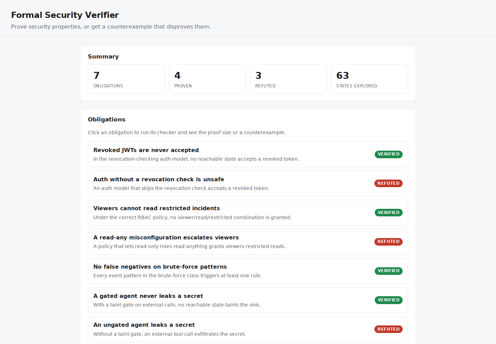
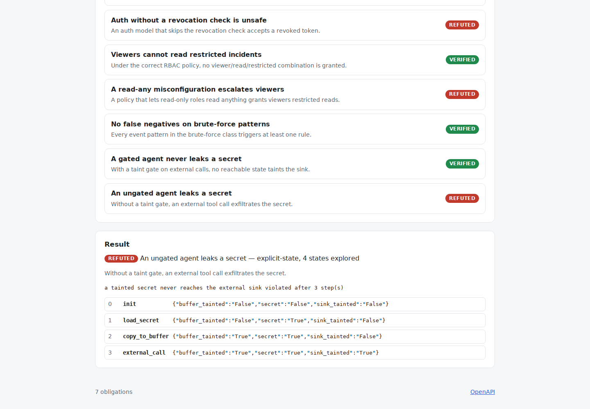

# Formal Security Verifier

**Stop testing security properties — prove them. This checker exhaustively
verifies safety properties of security designs, and when a design is broken it
hands you the exact counterexample: a revoked-token replay, a viewer reading a
restricted incident, a secret reaching an external tool.**

[](https://github.com/Vincent-P-essy/formal-security-verifier/actions/workflows/ci.yml)
[](pyproject.toml)
[](LICENSE)

Formal Security Verifier is a small, self-contained verification engine — no
external SMT solver, no TLA+, no Java. It combines two decision procedures: an
**explicit-state model checker** that proves invariants by exhaustive breadth-first
reachability over finite transition systems, and an **exhaustive relational
checker** (Alloy-style) that proves predicates over bounded universes. For finite
models both are complete: a `verified` result is a proof *for that model*, not a
bounded approximation, and a `refuted` result always comes with a concrete
witness.

The catalogue holds seven security obligations. Four model correct designs and
are proven; three model deliberately broken designs and are refuted with
counterexamples. Verifying that the checker *proves the safe designs and catches
the unsafe ones* is the whole point — it distinguishes a real verifier from one
that rubber-stamps everything. It is a portfolio-grade prototype; the value of a
proof is bounded by how faithfully each small model abstracts a real design.

## Dashboard Preview





Local verification of the repository’s finite security models, including a counterexample for the ungated agent.

## Measured evidence

| Measurement | Reviewed result | Scope |
|---|---:|---|
| Obligations discharged as expected | **7/7** | 4 proven, 3 refuted, vs `fixtures/ground-truth.json` |
| Proofs (exhaustive over finite models) | **4/4** | e.g. 27 assignments for RBAC, full reachability for auth |
| Broken designs caught with a counterexample | **3/3** | Trace or assignment witness for each |
| Determinism across 500 passes | **1 identical outcome hash** | Verdicts + counterexamples, hash is stable |
| Total states / assignments explored | **63** | Across all seven models |
| Test coverage | **95.53%** | Branch-aware source coverage |

See the [methodology](docs/METHODOLOGY.md) and [reviewed reference run](benchmarks/reference/README.md).

## The seven obligations

| Obligation | Method | Verdict | What it establishes |
|---|---|---|---|
| `jwt-revocation-safety` | explicit-state | **verified** | A revocation-checking auth model never accepts a revoked token |
| `jwt-missing-revocation-check` | explicit-state | **refuted** | Skipping the check → `issue → revoke → present` accepts a dead token |
| `rbac-viewer-confinement` | relational | **verified** | No `viewer / read / restricted` grant exists under the correct policy |
| `rbac-broken-hierarchy` | relational | **refuted** | A "read-only roles read anything" misconfig escalates viewers |
| `correlation-no-false-negatives` | relational | **verified** | Every brute-force pattern triggers at least one detection rule |
| `secret-non-exfiltration` | explicit-state | **verified** | A taint-gated agent never lets a secret reach the sink |
| `secret-leak-via-tool` | explicit-state | **refuted** | Without the gate, `load → copy → external_call` exfiltrates the secret |

Each refuted obligation returns its witness — the shortest trace or the exact
assignment — so a broken design is not just flagged but explained.

## Why "proof" is the right word

For a finite model, exhaustive reachability is a decision procedure: it
terminates with a definite yes or no. When the auth model is fully explored and
no reachable state accepts a revoked token, that is a proof of the property *for
the model* — not "our tests passed". The honest caveat, stated plainly in the
[limitations](docs/LIMITATIONS.md), is that the proof is only as strong as the
model's fidelity to the real design, which is why every model here is small
enough to read in one screen.

## Quick start

Requirements: Python 3.11 or 3.12 and [`uv`](https://docs.astral.sh/uv/).

```bash
uv sync --frozen --all-extras

# Verify everything (4 proven, 3 refuted)
uv run verify verify all

# Inspect one broken design and its counterexample trace
uv run verify verify secret-leak-via-tool

# Measure it (deterministic)
uv run verify benchmark --iterations 500
```

Start the API and dashboard:

```bash
uv run verify serve --host 127.0.0.1 --port 8080
```

Open <http://127.0.0.1:8080> to browse obligations and step through each
counterexample. OpenAPI is at `/docs`.

## Important limitations

- A `verified` result is a proof **for the committed model**, not for any real
  system; the model is an abstraction a human must judge.
- The engine decides **finite** state spaces and **safety** invariants only — no
  liveness, fairness, unbounded data, or symbolic reasoning.
- It is self-contained by design, so it will not match an SMT-backed checker,
  TLA+/TLC, Alloy, or ProVerif on large models.
- The local API is unauthenticated and must be bound to loopback.

See [architecture](docs/ARCHITECTURE.md), [methodology](docs/METHODOLOGY.md), and
[limitations](docs/LIMITATIONS.md).
