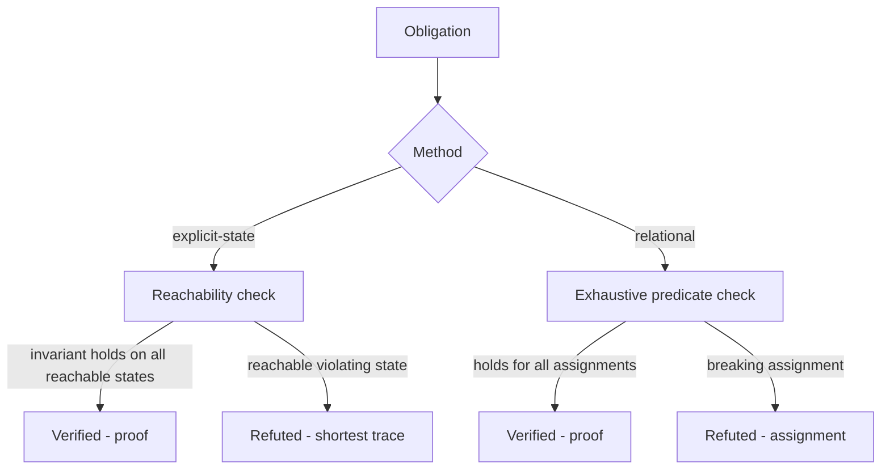

# Architecture

Two small engines, one result shape. An obligation is either a transition system
checked by reachability or a relational predicate checked by exhaustive
enumeration.

## Explicit-state model checking (`kripke.py`)

A `TransitionSystem` is initial assignments, guarded actions, and a safety
invariant. `check` runs breadth-first over reachable states:

- if a reachable state violates the invariant, it returns the **shortest** trace
  from an initial state (BFS gives the shortest counterexample);
- if the whole reachable space is explored with the invariant intact, the
  property is **proven** — the search was exhaustive over a finite space, not
  merely bounded;
- a `max_states` guard turns an accidentally infinite model into an
  `inconclusive` result rather than a false proof.

## Relational checking (`relational.py`)

A `RelationalCheck` declares finite sorts and a predicate that must hold for
every assignment in their product. `check_relational` enumerates the entire
product, so a pass is a proof over the bounded universe and a failure returns the
exact assignment that breaks it. This suits stateless facts — an access-control
matrix, detection-rule coverage — better than a temporal search.

## The catalogue (`obligations.py`)

Seven obligations, each pairing a claim with a model and the reviewer's expected
verdict. Four model correct designs (must be proven); three model deliberately
broken variants (must be refuted). Verifying that the checker *proves the correct
ones and catches the broken ones* is what makes a green run meaningful — a
checker that verified everything would be worthless.

## Why this is a proof, and of what

For a finite model, exhaustive reachability (or exhaustive enumeration) is a
decision procedure: it terminates with a definite answer. So `verified` here is a
proof **of the model**. The remaining gap — always present in model checking — is
whether the model faithfully abstracts the real design. The models are kept small
and readable precisely so that gap is easy for a reviewer to judge.
